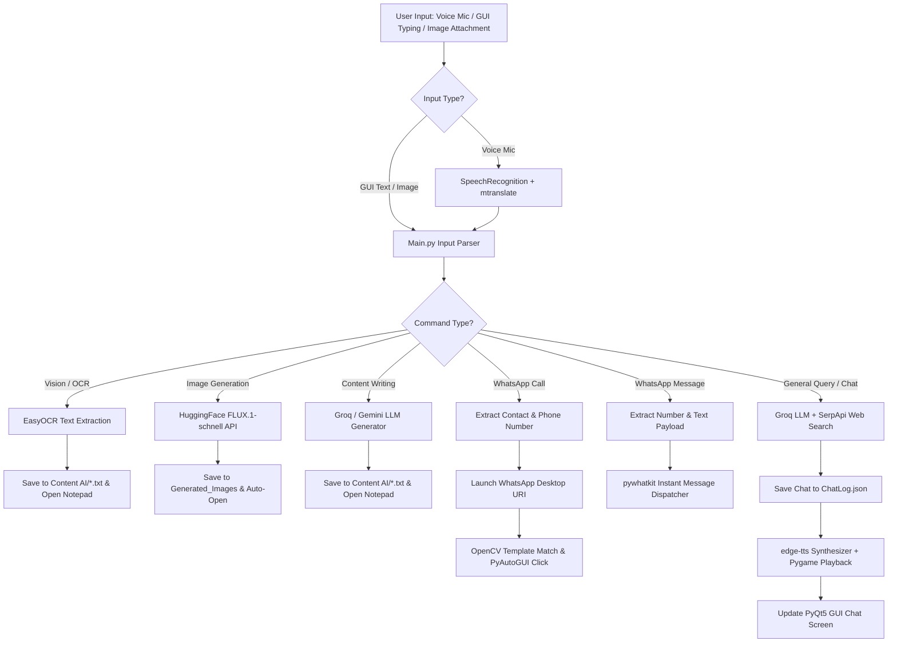

# 🤖 David AI — Comprehensive Project Summary & Technical Architecture

**David AI** is an autonomous, voice-centric, multimodal desktop AI assistant designed for Windows. Unlike standard conversational chatbots, David operates as an active **desktop agent** capable of executing physical real-world PC tasks: writing content into auto-opening text documents, extracting text from images via OCR, generating high-quality AI artwork, executing real-time web searches, sending WhatsApp messages, and auto-routing WhatsApp voice and video calls through native computer vision and GUI automation.

---

## 1. Executive Summary & Core Capabilities

| Feature Category | Description & Technical Implementation |
| :--- | :--- |
| **Voice & Speech Interface** | Hands-free continuous microphone listening, dynamic noise calibration, speech recognition with Google Speech API, multi-language translation, and asynchronous neural Text-to-Speech (TTS). |
| **Multi-Tiered LLM Routing** | High-speed primary inference via Groq (`llama-3.3-70b-versatile`), automatic failsafe fallback to Google Gemini (`gemini-2.5-flash`), and SerpApi web search fallback. |
| **Real-time Internet Search** | Dynamic web querying via SerpApi with custom text summarization for weather, news, stock quotes, and up-to-date facts. |
| **Image Vision & OCR** | Offline image text extraction using EasyOCR and PIL (`Pillow`), saving extracted text directly into `Content AI/` and launching Windows Notepad. |
| **AI Image Generation** | High-fidelity 4K image generation using HuggingFace Inference API (`FLUX.1-schnell` model by Black Forest Labs) with auto-display. |
| **Automated Content Creation** | Generates essays, leave applications, emails, routines, letters, and articles, saving them to `.txt` files in `Content AI/` and opening `notepad.exe`. |
| **WhatsApp Call & Message Automation** | Deep-link routing via `pywhatkit` and `webbrowser`, followed by computer vision interface clicking using `pyautogui` and `opencv-python` to place WhatsApp voice/video calls. |
| **Custom PyQt5 Desktop GUI** | Sleek frameless dark-mode window featuring an animated assistant GIF avatar, speech status feedback, chat thread, image attachment for vision, mic toggles, and top-bar controls. |

---

## 2. Directory Structure & File Breakdown

### 📁 Backend Subsystem
- 📄 [Main.py](file:///c:/Users/prath/OneDrive/Desktop/David/Backend/Main.py) — **Master Orchestrator & Logic Controller**. Coordinates background voice listening, vision processing, image generation, content drafting, WhatsApp messaging/calling automation, chat logging to `Data/ChatLog.json`, and launches the PyQt5 frontend GUI.
- 📄 [RealtimeSearchEngine.py](file:///c:/Users/prath/OneDrive/Desktop/David/Backend/RealtimeSearchEngine.py) — **AI Inference & Web Search Engine**. Houses system prompts and manages the multi-tier LLM priority chain (Groq $\rightarrow$ Gemini $\rightarrow$ SerpApi + `SummarizeText`).
- 📄 [SpeechToText.py](file:///c:/Users/prath/OneDrive/Desktop/David/Backend/SpeechToText.py) — **Audio Capture & STT**. Configures PyAudio microphone input, adjusts ambient noise thresholds, transcribes speech via `SpeechRecognition`, translates non-English speech via `mtranslate`, and listens for voice stop commands ("stop reading", "stop speaking").
- 📄 [TextToSpeech.py](file:///c:/Users/prath/OneDrive/Desktop/David/Backend/TextToSpeech.py) — **Neural Audio Synthesizer**. Uses `edge-tts` with voice `en-US-ChristopherNeural` (pitch/rate tuned). Plays audio asynchronously via Pygame mixer without blocking the GUI loop and supports mid-sentence audio stopping (`StopSpeech`).
- 📄 [ImageGeneration.py](file:///c:/Users/prath/OneDrive/Desktop/David/Backend/ImageGeneration.py) — **AI Art Generator**. Dispatches prompt requests to HuggingFace FLUX.1-schnell model, saves PNG files to `Generated_Images/`, and opens them via native Windows OS handlers.
- 📁 **Whatsup_calling/** — Stores visual reference image templates used by OpenCV for desktop call button recognition:
  - 🖼️ `Call.png` — Main call icon template.
  - 🖼️ `Voice_call.png` — Voice call dropdown button template.
  - 🖼️ `Video_call.png` — Video call dropdown button template.

---

### 📁 Frontend Subsystem
- 📄 [GUI.py](file:///c:/Users/prath/OneDrive/Desktop/David/Frontend/GUI.py) — **PyQt5 Desktop Application**. Implements:
  - `MainWindow`: Frameless main window container with top navigation bar.
  - `CustomTopBar`: Custom title bar supporting Home/Chat views, minimizing, maximizing/restoring, and closing.
  - `InitialScreen`: Home screen layout featuring full screen centered `David.gif` visualizer, status updates, and interactive mic toggle.
  - `ChatSection` / `MessageScreen`: Interactive chat console supporting multi-colored text, live update timers, attachment button (📎) for image vision prompts, text input field, send button, and mic toggle.
- 📁 **Files/** — **IPC Inter-Process Data Buffer**:
  - `Mic.data` — Holds microphone active state (`True`/`False`).
  - `Status.data` — Stores real-time status string displayed on GUI (e.g., `Listening ...`, `Thinking ...`, `Generating Image ...`).
  - `Responses.data` — Holds latest text response output for rendering in GUI chat.
  - `TypedQuery.data` — Buffer for text queries submitted via typing in the GUI.
  - `Database.data` — Internal temp file initialization check.
- 📁 **Graphics/** — UI graphical assets including `David.gif`, `Mic_on.png`, `Mic_off.png`, `send-message.png`, `Home.png`, `Chats.png`, `Close.png`, `Maximize.png`, and `Minimize2.png`.

---

### 📁 Workspace Root & Data Storage
- 📁 [Content AI/](file:///c:/Users/prath/OneDrive/Desktop/David/Content%20AI) — Output directory for text generation. Holds files such as `essay.txt`, `application.txt`, `leave_application.txt`, `email.txt`, `extracted_text.txt`.
- 📁 [Data/](file:///c:/Users/prath/OneDrive/Desktop/David/Data) — Holds chat log database [ChatLog.json](file:///c:/Users/prath/OneDrive/Desktop/David/Data/ChatLog.json) and cached audio streams (`speech.mp3`).
- 📁 [Generated_Images/](file:///c:/Users/prath/OneDrive/Desktop/David/Generated_Images) — Storage directory for AI-synthesized FLUX.1 images.
- 📄 [GenerateReport.py](file:///c:/Users/prath/OneDrive/Desktop/David/GenerateReport.py) — Python script using `python-docx` to generate project architecture documentation (`David_AI_Project_Report_V2.docx`).
- 📄 [search.py](file:///c:/Users/prath/OneDrive/Desktop/David/search.py) — Standalone diagnostic script for testing Google Gemini API integration.
- 📄 [Requirement.txt](file:///c:/Users/prath/OneDrive/Desktop/David/Requirement.txt) — Comprehensive Python dependency manifest.
- 📄 [.env](file:///c:/Users/prath/OneDrive/Desktop/David/.env) — Central configuration file storing environment variables, assistant name, voice preference, username, and API keys.

---

## 3. Libraries & Dependencies Manifest

| Library / Package | Role in Project |
| :--- | :--- |
| **PyQt5** | Renders the custom desktop interface, window layouts, top bar, chat widget, animations, and non-blocking timer loops. |
| **groq** | Official SDK connecting to Groq Cloud for fast LLaMA 3.3 70B model inference. |
| **google-genai** | Official Google GenAI SDK for Gemini 2.5 Flash model access. |
| **requests** | Handles HTTP requests for HuggingFace image generation and SerpApi web search. |
| **SpeechRecognition** & **pyaudio** | Captures real-time raw microphone audio streams and performs speech-to-text recognition via Google Speech API. |
| **mtranslate** | Automatic multi-language translation of spoken user input into English. |
| **edge-tts** | Asynchronous speech synthesis using Microsoft Edge Neural voices. |
| **pygame** | Low-latency audio mixer used for non-blocking playback and interruption of generated TTS audio files. |
| **pyautogui** & **opencv-python** | GUI automation and computer vision template matching to physically locate buttons and interact with WhatsApp Desktop. |
| **easyocr** & **Pillow (PIL)** | Offline optical character recognition to extract text from images uploaded by the user. |
| **pywhatkit** | Automates sending instant WhatsApp messages to specified contact numbers. |
| **bs4 (BeautifulSoup4)** & **googlesearch-python** | HTML parsing and fallback web search utilities. |
| **python-docx** | Algorithmic construction of `.docx` Word reports. |
| **python-dotenv** | Loads configuration key-value pairs from `.env`. |
| **AppOpener**, **keyboard**, **cohere**, **webdriver-manager**, **selenium** | Auxiliary automation and extended feature support utilities. |

---

## 4. API & Cloud Service Architecture

1. **Groq Cloud API (`llama-3.3-70b-versatile`)**: Primary intelligence layer. Executes intent classification, natural conversational responses, contact phone number extraction, and query interpretation.
2. **Google Gemini API (`gemini-2.5-flash`)**: Secondary intelligence failsafe. Automatically invoked if Groq encounters rate limits or network issues.
3. **SerpApi (Google Search)**: Real-time web scraping API triggerable when queries contain question words (`who`, `what`, `where`, `news`, `weather`, `latest`).
4. **HuggingFace Inference API (`FLUX.1-schnell`)**: Generates 4K detailed images from descriptive prompt inputs.

---

## 5. Workflow & Execution Flow

---

## 6. Inter-Process Communication (IPC) & File Buffers

The system utilizes asynchronous filesystem buffers inside `Frontend/Files/` to decouple the PyQt5 GUI thread from heavy processing loops in `Backend/Main.py`:

- **Mic Toggle Synchronization**: `Mic.data` is modified by `GUI.py` when clicking the mic button. `Main.py` inspects `GetMicrophoneStatus()` inside `VoiceThread()` to start/pause `SpeechRecognition()`.
- **Status Broadcasting**: `Status.data` is updated by backend functions (`SetAssistantStatus("Thinking ...")`), and read by `GUI.py` every 100ms via `QTimer` to refresh the dynamic status label.
- **Response Delivery**: `Responses.data` receives final assistant text output, which `GUI.py` monitors to automatically switch to the Chat tab and display the message.
- **Typed Input Queue**: When text is submitted in the GUI text field, it is saved into `TypedQuery.data`. `VoiceThread()` reads and clears this file to process typed requests instantly.
