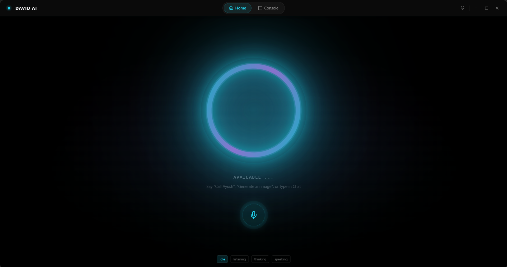
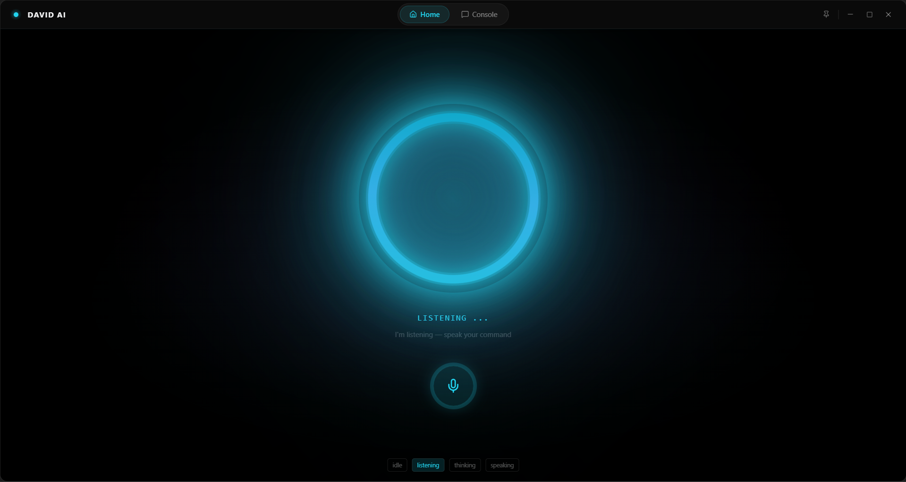
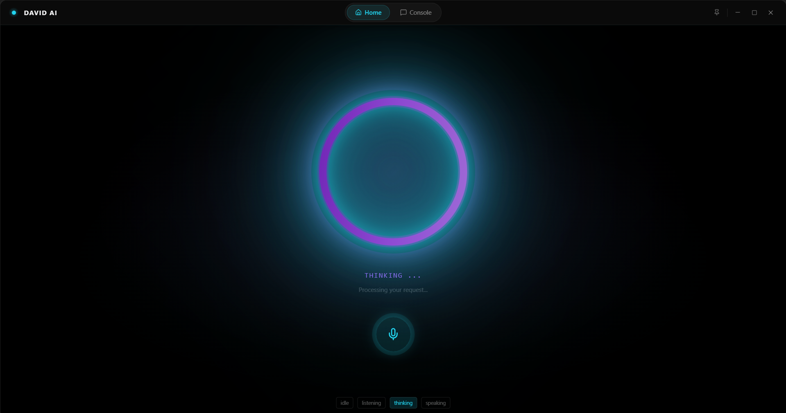
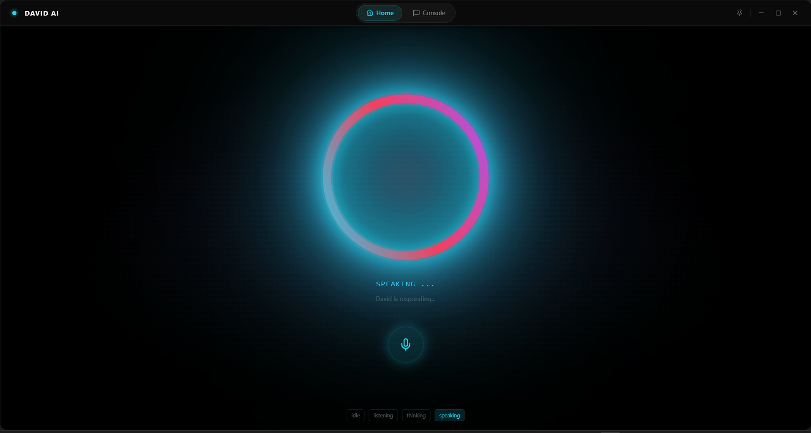
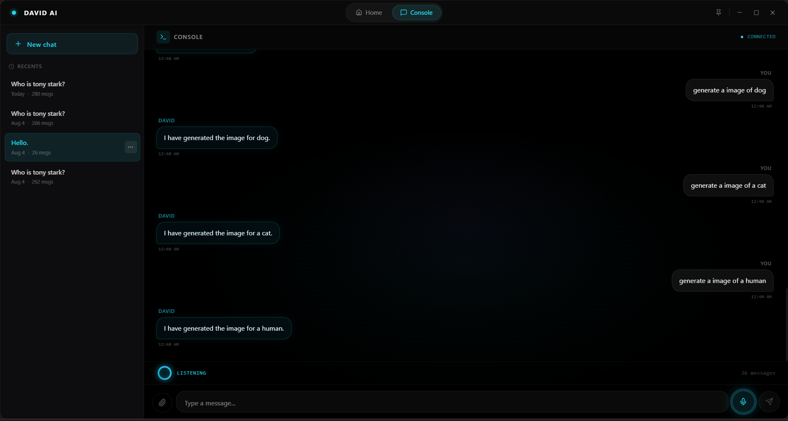
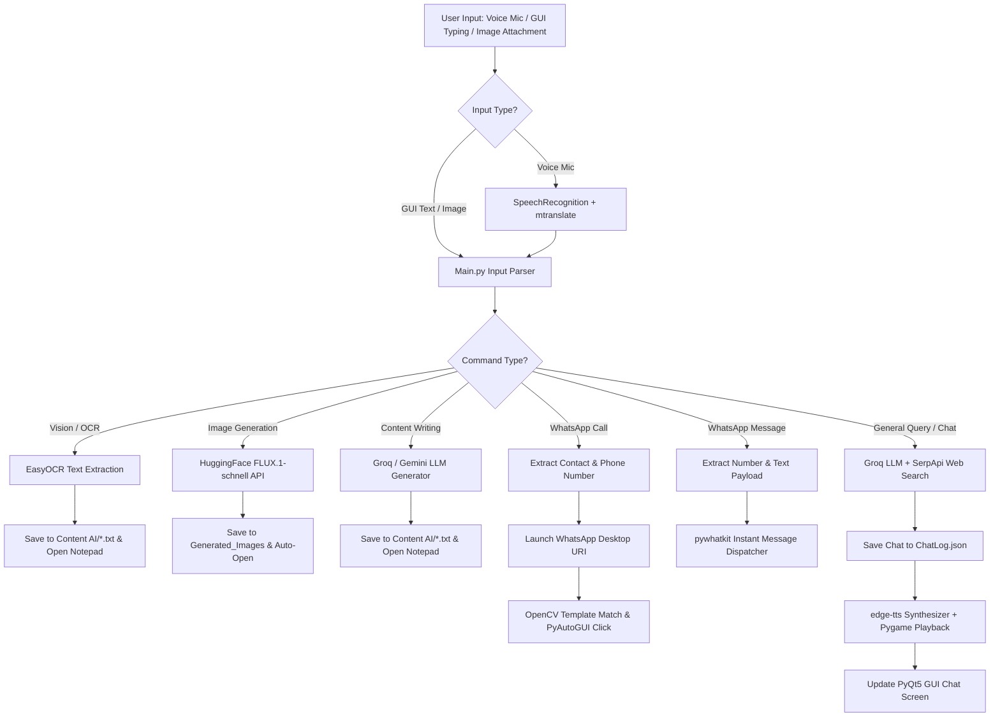

# 🤖 David AI — Voice-Centric Multimodal Desktop Assistant

[](https://www.python.org/)
[](https://microsoft.com/windows)
[](LICENSE)
[](https://www.riverbankcomputing.com/software/pyqt/)

**David AI** is an autonomous, voice-centric, multimodal desktop AI assistant designed exclusively for Windows. Operating as an active desktop agent, David handles physical real-world PC tasks: OCR text extraction, HuggingFace image generation, SerpApi search routing, text content generation (auto-opening Notepad), and native WhatsApp calling/messaging automation via computer vision.

---

## 🌟 Core Capabilities & Deep Feature Dive

David AI is packed with features that blur the line between a voice assistant and an autonomous desktop agent. Each capability is explained in detail below:

### 🎙️ 1. Speech Recognition & Neural TTS
*   **Continuous Hands-Free Listening**: The assistant runs an active listener thread (`VoiceThread`) using `SpeechRecognition` and PyAudio. It dynamically calibrates itself to ambient room noise so it only captures active speech commands.
*   **Real-time Multilingual Translation**: If you speak in another language, David dynamically translates the speech into English in real time using the `mtranslate` library before processing the command.
*   **Microsoft Edge Neural Text-to-Speech**: Synthesizes highly realistic human speech utilizing `edge-tts` with the tuned `en-US-ChristopherNeural` voice model.
*   **Interruptible Pygame Mixer Playback**: Speech audio playback is handled by a background Pygame audio mixer thread. If David is reading a long answer and you say *"stop reading"* or *"stop speaking"*, the playback is immediately stopped asynchronously.

### 🧠 2. Multi-Tiered AI Routing & Web Search
*   **High-Speed Groq Inference**: Routes primary natural language processing and intent matching through Groq Cloud (`llama-3.3-70b-versatile`) for sub-second responses.
*   **Google Gemini Failsafe**: If Groq encounters API rate-limits or network failures, the orchestrator automatically cascades request processing to Google Gemini (`gemini-2.5-flash`) as an active fallback.
*   **SerpApi Web Search Integration**: When asking for real-time information (e.g. news, weather, stock prices, or events), the LLM routing layer triggers a live web query using `SerpApi`. David summarizes the search results and reads them out loud.

### 📝 3. Autonomous Content Writing & Notepad Launching
*   **Full Document Drafting**: David can draft high-quality textual content, including sick leave applications, diet routines, exercise plans, letters, poems, resumes, and essays.
*   **Dynamic Document Open**: When you ask David to write something (for example: *"write an email to my boss for sick leave"*), it triggers the LLM to generate the document body, writes it directly into a formatted `.txt` file (like `leave_application.txt` or `email.txt`) inside the `Content AI/` folder, and automatically launches the native Windows **Notepad (`notepad.exe`)** to display the document on your screen.
*   **No Chat Clutter**: Instead of printing long documents in the small chat window, David shows a confirmation message in the chat logs (*"I have generated the leave application and opened it in Notepad"*), keeping your interface clean.

### 💬 4. WhatsApp Message Automation
*   **Instant Message Dispatch**: Send WhatsApp messages using natural voice commands (e.g., *"send a message on WhatsApp to Ayush saying I am reaching in 10 minutes"*).
*   **Dynamic Parsing**: The backend utilizes Groq/Gemini to extract the contact's name, match it against a list of known contacts (like *Ayush* or *My Number*), and format the message payload.
*   **Browser-less Sending**: Uses the `pywhatkit` library to open the WhatsApp target chat and dispatch the message instantly in the background, utilizing a 15-second abort timer in case the user decides to cancel it.

### 📞 5. WhatsApp Desktop GUI Call Automation (Voice & Video)
*   **Voice & Video Calls**: Trigger native WhatsApp Desktop voice and video calls entirely hands-free (e.g., *"make a video call to Ayush on WhatsApp"*).
*   **WhatsApp Deep-Link Routing**: Launches the WhatsApp Desktop client directly to the recipient's chat window using custom deep-link URIs (`whatsapp://send?phone=<number>`).
*   **OpenCV & PyAutoGUI Computer Vision**: Once the WhatsApp client is active, a background automation thread waits for the UI to load, uses `pyautogui` and `opencv-python` to perform template matching against visual image templates (`Call.png`, `Voice_call.png`, and `Video_call.png` located in `Backend/Whatsup_calling/`), physically clicks the call dropdown, moves the cursor, and clicks the target *Voice Call* or *Video Call* button.

### 📷 6. Image Vision & OCR (Optical Character Recognition)
*   **Offline Image Reading**: If you upload or attach an image to the chat window, the system triggers the EasyOCR visual engine.
*   **OCR Text Extraction**: Uses `EasyOCR` + `Pillow (PIL)` to read and extract all text content from the image offline.
*   **Auto-Open Extracted Text**: The extracted text is saved to `Content AI/extracted_text.txt` and opened automatically in Windows Notepad, while a summary preview is printed and read aloud in the chat GUI.

### 🎨 7. AI Image Generation (FLUX.1)
*   **FLUX.1-schnell Engine**: Instantly generates 4K creative images from descriptive prompts (e.g., *"generate an image of Thor in neon armor"*).
*   **HuggingFace API Integration**: Sends prompts to HuggingFace, saves the generated PNG files to `Generated_Images/`, and launches the Windows Photo Viewer to open and show the generated art.

---

## 🖥️ User Interface Design
David AI features a **Premium PyQt5 Frameless GUI** crafted for seamless interactions:
- **Frameless Dark-Mode Window**: Supports custom window dragging, minimizing, maximizing, and closing.
- **Animated Avatar visualizer**: Embedded `David.gif` visualizer that animates during idle, listening, and speaking states.
- **Dynamic Message Logs**: Full-fledged scrollable chat log that updates dynamically.
- **Voice/Type Dual Input**: Fully supports text prompt typing, image attachments, and physical microphone toggle.

---

## 🖼️ User Interface & Assistant States
David AI features a dynamic PyQt5-based interface that shifts visually depending on the assistant's state. Below are screenshots of the different active modes:

| Available (Idle) | Listening | Thinking |
| :---: | :---: | :---: |
|  |  |  |

| Speaking | Interactive Chat View |
| :---: | :---: |
|  |  |

---

## 🎨 Image Generation Showcase
David AI can generate high-fidelity, creative artwork using the `FLUX.1-schnell` model. Here are some examples of images generated by the assistant:

| Human Image | Cat Image | Iron Man (Tony Stark) |
| :---: | :---: | :---: |
|  |  |  |

---

## 📐 System Architecture & Workflow

The orchestrator (`Main.py`) intercepts voice inputs, types inputs, or files, interprets the user's intent, and routes it to the corresponding engine:



### 📂 Inter-Process Communication (IPC)
The system decouples the PyQt5 UI thread from heavy backend processing loops through lightweight filesystem buffers located in `Frontend/Files/`:
- **`Mic.data`**: Synchronizes microphone activation between the GUI mic button and the backend listener thread.
- **`Status.data`**: Broadcasts the assistant's state (`Listening...`, `Thinking...`, `Generating Image...`) to the GUI's status indicator.
- **`Responses.data`**: Transports the final text response to be rendered in the chat panel.
- **`TypedQuery.data`**: Queues keyboard-submitted questions for immediate backend processing.

---

## 📂 Project Directory Layout

```text
David/
├── .env                              # Environment variable keys
├── .gitignore                        # Git exclusion rules
├── David.gif                         # Main GUI visualizer avatar
├── GenerateReport.py                 # Generates docx architecture documentation
├── Requirement.txt                   # Dependency manifest
├── search.py                         # Diagnostic API test script
├── Backend/                          # Backend Orchestrator & Services
│   ├── Main.py                       # Master controller & loop orchestrator
│   ├── RealtimeSearchEngine.py       # LLM client & SerpApi web query router
│   ├── SpeechToText.py               # Ambient noise calibration and audio listener
│   ├── TextToSpeech.py               # Edge neural TTS synthesizer
│   ├── ImageGeneration.py            # FLUX.1 HuggingFace API interface
│   ├── Server.py                     # Websocket service utility
│   └── Whatsup_calling/              # OpenCV call UI templates (Call, Voice_call, Video_call)
├── Frontend/                         # PyQt5 Desktop Application
│   ├── GUI.py                        # Frameless GUI layouts, custom bars, and events
│   ├── Files/                        # IPC File Buffers (Mic, Status, Responses, TypedQuery)
│   └── Graphics/                     # UI visual asset files
└── frontend-tauri/                   # Tauri + React/TypeScript alternative GUI bootstrap
```

---

## 🚀 Setup & Installation

### 1. Clone the repository
```bash
git clone https://github.com/PrathamRajendraPednekar/David-AI.git
cd David-AI
```

### 2. Configure Environment Variables
Create a `.env` file in the root directory and add your credentials:
```env
# Assistant Settings
ASSISTANT_NAME=David
USERNAME=Pratham
VOICE_NAME=en-US-ChristopherNeural

# API Keys
GROQ_API_KEY=your_groq_api_key_here
GEMINI_API_KEY=your_gemini_api_key_here
SERP_API_KEY=your_serpapi_key_here
HF_API_KEY=your_huggingface_api_key_here
```

### 3. Install Dependencies
Make sure you have [Python 3.10+](https://www.python.org/downloads/) installed. Install all required packages:
```bash
pip install -r Requirement.txt
```

*(Note: If you plan to run the Tauri UI, navigate to `frontend-tauri/` and run `npm install`.)*

### 4. Run the Application
Start the master orchestrator to launch both the backend listening services and the PyQt5 GUI:
```bash
python Backend/Main.py
```

---

## 💡 Troubleshooting & Notes
- **WhatsApp Call Automation**: Ensure that you have the official WhatsApp Desktop app installed and logged in. The calling sequence relies on OpenCV matching the template images in `Backend/Whatsup_calling/`. If your screen resolution or WhatsApp theme differs, you may need to capture new templates and replace `Call.png`, `Voice_call.png`, and `Video_call.png`.
- **Microphone issues**: If David isn't capturing voice commands, check your OS default input device and ensure PyAudio permissions are configured.
