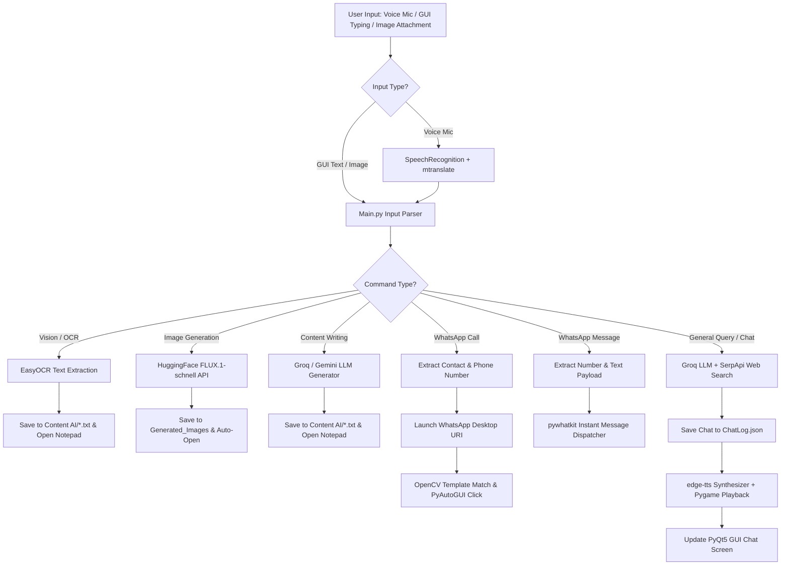

# 🤖 David AI — Voice-Centric Multimodal Desktop Assistant

[](https://www.python.org/)
[](https://microsoft.com/windows)
[](LICENSE)
[](https://www.riverbankcomputing.com/software/pyqt/)

**David AI** is an autonomous, voice-centric, multimodal desktop AI assistant designed exclusively for Windows. Operating as an active desktop agent, David handles physical real-world PC tasks: OCR text extraction, HuggingFace image generation, SerpApi search routing, text content generation (auto-opening Notepad), and native WhatsApp calling/messaging automation via computer vision.

---

## 🌟 Core Capabilities & Features

### 🎙️ Speech & Neural Audio
*   **Continuous Microphone Capture**: Hands-free voice recognition with auto-noise calibration.
*   **Speech-to-Text (STT)**: Fast transcription via Google Speech API with automatic translation to English.
*   **Neural Text-to-Speech (TTS)**: Realistic speech synthesis via Microsoft Edge's `en-US-ChristopherNeural` voice.
*   **Non-Blocking Pygame Mixer**: Allows audio playback to run asynchronously in a separate thread and enables immediate interruptible stop commands ("stop reading", "stop speaking").

### 🧠 Multi-Tiered Intelligent Routing
*   **Primary Inference**: Fast LLM processing via Groq Cloud (`llama-3.3-70b-versatile`).
*   **Secondary Failsafe fallback**: Automatic fallback to Google Gemini (`gemini-2.5-flash`) if Groq hits rate-limits.
*   **Search Fallback**: Dynamically executes Google searches via SerpApi when asking for current facts, news, or weather.

### 🖼️ Multimodal Vision & AI Art
*   **Offline OCR Text Extraction**: Processes visual inputs via `EasyOCR` + `Pillow (PIL)`, outputs plain text, and opens them in Windows Notepad.
*   **AI Image Generation**: Dispatches prompts to HuggingFace's `FLUX.1-schnell` model and automatically displays the generated high-quality PNG.

### ⚙️ Desktop & App Automation
*   **Auto Content Generation**: Drafts emails, essay files, leave applications, or routine tasks, saving them in the `Content AI/` folder and launching `notepad.exe`.
*   **WhatsApp Automated Messaging**: Automatically dispatches instant WhatsApp text messages via `pywhatkit`.
*   **WhatsApp GUI Call Automation**: Uses OpenCV template matching and PyAutoGUI to physically click buttons and initiate WhatsApp Desktop voice/video calls.

---

## 🖥️ User Interface Design
David AI features a **Premium PyQt5 Frameless GUI** crafted for seamless interactions:
- **Frameless Dark-Mode Window**: Supports custom window dragging, minimizing, maximizing, and closing.
- **Animated Avatar visualizer**: Embedded `David.gif` visualizer that animates during idle, listening, and speaking states.
- **Dynamic Message Logs**: Full-fledged scrollable chat log that updates dynamically.
- **Voice/Type Dual Input**: Fully supports text prompt typing, image attachments, and physical microphone toggle.

---

## 📐 System Architecture & Workflow

The orchestrator (`Main.py`) intercepts voice inputs, types inputs, or files, interprets the user's intent, and routes it to the corresponding engine:



### 📂 Inter-Process Communication (IPC)
The system decouples the PyQt5 UI thread from heavy backend processing loops through lightweight filesystem buffers located in `Frontend/Files/`:
- **`Mic.data`**: Synchronizes microphone activation between the GUI mic button and the backend listener thread.
- **`Status.data`**: Broadcasts the assistant's state (`Listening...`, `Thinking...`, `Generating Image...`) to the GUI's status indicator.
- **`Responses.data`**: Transports the final text response to be rendered in the chat panel.
- **`TypedQuery.data`**: Queues keyboard-submitted questions for immediate backend processing.

---

## 📂 Project Directory Layout

```text
David/
├── .env                              # Environment variable keys
├── .gitignore                        # Git exclusion rules
├── David.gif                         # Main GUI visualizer avatar
├── GenerateReport.py                 # Generates docx architecture documentation
├── Requirement.txt                   # Dependency manifest
├── search.py                         # Diagnostic API test script
├── Backend/                          # Backend Orchestrator & Services
│   ├── Main.py                       # Master controller & loop orchestrator
│   ├── RealtimeSearchEngine.py       # LLM client & SerpApi web query router
│   ├── SpeechToText.py               # Ambient noise calibration and audio listener
│   ├── TextToSpeech.py               # Edge neural TTS synthesizer
│   ├── ImageGeneration.py            # FLUX.1 HuggingFace API interface
│   ├── Server.py                     # Websocket service utility
│   └── Whatsup_calling/              # OpenCV call UI templates (Call, Voice_call, Video_call)
├── Frontend/                         # PyQt5 Desktop Application
│   ├── GUI.py                        # Frameless GUI layouts, custom bars, and events
│   ├── Files/                        # IPC File Buffers (Mic, Status, Responses, TypedQuery)
│   └── Graphics/                     # UI visual asset files
└── frontend-tauri/                   # Tauri + React/TypeScript alternative GUI bootstrap
```

---

## 🚀 Setup & Installation

### 1. Clone the repository
```bash
git clone https://github.com/PrathamRajendraPednekar/David-AI.git
cd David-AI
```

### 2. Configure Environment Variables
Create a `.env` file in the root directory and add your credentials:
```env
# Assistant Settings
ASSISTANT_NAME=David
USERNAME=Pratham
VOICE_NAME=en-US-ChristopherNeural

# API Keys
GROQ_API_KEY=your_groq_api_key_here
GEMINI_API_KEY=your_gemini_api_key_here
SERP_API_KEY=your_serpapi_key_here
HF_API_KEY=your_huggingface_api_key_here
```

### 3. Install Dependencies
Make sure you have [Python 3.10+](https://www.python.org/downloads/) installed. Install all required packages:
```bash
pip install -r Requirement.txt
```

*(Note: If you plan to run the Tauri UI, navigate to `frontend-tauri/` and run `npm install`.)*

### 4. Run the Application
Start the master orchestrator to launch both the backend listening services and the PyQt5 GUI:
```bash
python Backend/Main.py
```

---

## 💡 Troubleshooting & Notes
- **WhatsApp Call Automation**: Ensure that you have the official WhatsApp Desktop app installed and logged in. The calling sequence relies on OpenCV matching the template images in `Backend/Whatsup_calling/`. If your screen resolution or WhatsApp theme differs, you may need to capture new templates and replace `Call.png`, `Voice_call.png`, and `Video_call.png`.
- **Microphone issues**: If David isn't capturing voice commands, check your OS default input device and ensure PyAudio permissions are configured.
